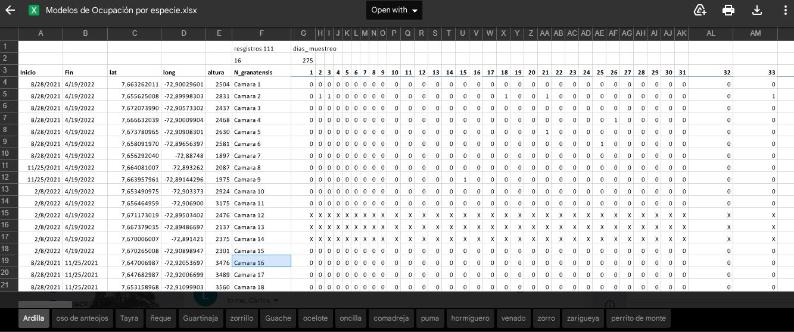

```{r setup, include=FALSE}
knitr::opts_chunk$set(echo = TRUE, warning=FALSE, message=FALSE)
```

Antes de comenzar debemos instalar y cargar los paquetes: terra, mapview, sf, unmarked, tidyverse, geodata, readxl


```{r warning=FALSE, message=FALSE}
library(terra)

library(raster)
library(rasterVis)
library(mapview)
library(sf)
library(unmarked)
library(tidyverse)
library(geodata)
library(readxl)

```


Partiendo de la tabla de excel con la estructura: 

Tomaremos la primera pestaña: Ardilla para el ejemplo. 

Primero hay que cargar el archivo de excel desde la carpeta data, luego eliminar las camaras que no funcionaron y, luego calcular el centroide


```{r}

tabla <- read_excel("data/tabla.xlsx", 
    sheet = "Ardilla", skip = 2, na = "X")


# elliminar filas 12, 13, 14
tabla <- tabla[c(-14,-13,-12),]
# View(tabla)
# convierte a terra
puntos <- vect(tabla, geom=c("long", "lat"), crs="EPSG:4326")
# convierte a sf
puntos_sf <- sf::st_as_sf(puntos)


```


Importar datos geograficos con el centroide de la coordenada 

```{r}

# centroide for terra
# centoide <- centroids(puntos, TRUE)
centroide <- c(mean(tabla$long), mean(tabla$lat))
clip_window <- extent(-72.92554, -72.87, 7.63, 7.68)
bb <- c(-72.92554, -72.87, 7.63, 7.68)

#srtm <- raster::getData('SRTM', lon=centroide[1], lat=centroide[2])

#altitud <- elevation_3s(-72.893262, 7.664081007, path="data")

altitud <- rast("D:/BoxFiles/Box Sync/CodigoR/Tesistas/srtm_22_11.tif")

# crop the  raster using the vector extent
srtm_crop <- crop(altitud, clip_window)

# elevation.crop and terrain covs
elevation <- raster(srtm_crop)
slope<-raster(terrain(srtm_crop, v="slope"))
aspect <- raster(terrain(srtm_crop, v="aspect"))
roughness <- raster(terrain(srtm_crop, v="roughness") )

cov.stack<-raster::stack(elevation, slope, aspect, roughness)
names(cov.stack) <- c("elevation", "slope", "aspect", "roughness" )
# cosv.ras <- raster(rast(cov.stack))
# plot(cov.stack)

cam_covs <- raster::extract(cov.stack, puntos_sf)

full_covs <- as.data.frame(cam_covs) # convert to Data frame
full_covs_1 <- scale(full_covs)
full_covs_s <- as.data.frame(full_covs_1)
# full_covs_s$camara <- cams_loc_QR # add camera name

# library(leaflet)
# leaflet(sf::st_as_sf(puntos)) %>%
#    addTiles() %>%
#   addCircleMarkers()
mapview(puntos_sf, map.types = c("Esri.WorldImagery", "OpenTopoMap"), color = "grey40")

```


# Analisis de ocupacíon

```{r}

# Make unmarked frame
umf_y_full<- unmarkedFrameOccu(y= tabla[,7:281])
siteCovs(umf_y_full) <- full_covs_s # data.frame(Elev=full_covs$Elev) # Full
#######Graficar umf
plot(umf_y_full)


# build  models
mf0<-occu(~1 ~ 1, umf_y_full)
mf1<-occu(~1 ~ elevation, umf_y_full)
mf2<-occu(~1 ~ elevation +I(elevation^2), umf_y_full)
mf3<-occu(~1 ~ slope, umf_y_full)
mf4<-occu(~1 ~ aspect, umf_y_full)
mf5<-occu(~1 ~ roughness, umf_y_full, starts = c(0.6, -3, 0))
mf6<-occu(~elevation +I(elevation^2) ~ elevation +I(elevation^2), umf_y_full)
mf7<-occu(~roughness ~ elevation +I(elevation^2), umf_y_full)
mf8<-occu(~slope ~ elevation +I(elevation^2), umf_y_full)


# fit list
fms1<-fitList("p(.) Ocu(.)"=mf0,
              "p(.) Ocu(elev)"=mf1,
              "p(.) Ocu(elev^2)"=mf2,
              "p(.) Ocu(slope)"=mf3,
              "p(.) Ocu(aspect)"=mf4,
              "p(.) Ocu(roughness)"=mf5,
              "p(elev^2) Ocu(elev^2)"=mf6,
              "p(roughness) Ocu(elev^2)"=mf7,
              "p(slope) Ocu(elev^2)"=mf8
)

modSel(fms1)

# el mejor modelo es el mf6


```


# Ajuste del modelo

```{r}
pb_f <- parboot(mf6, nsim=500, report=10) 
## t0 = 36.31634
plot (pb_f)

```

# Prediccón

```{r}
newdat_range<-data.frame(elevation=seq(min(full_covs_s$elevation),
                                       max(full_covs_s$elevation),length=100), 
                         roughness=seq(min(full_covs_s$roughness),
                                       max(full_covs_s$roughness), length=100))


## plot Detection en escala original
pred_det <-predict(mf6, type="det", newdata=newdat_range, appendData=TRUE)
plot(Predicted~elevation, pred_det,type="l",col="blue", 
     xlab="Elevation",
     ylab="Detection Probability",
     xaxt="n")
xticks <- c(-1, -0.5, 0, 0.5, 1, 1.5, 2, 2.5, 3) # -1:2
xlabs <- xticks*sd(full_covs$roughness) + mean(full_covs$roughness) #Use the mean and sd of original value to change label name
axis(1, at=xticks, labels=round(xlabs, 1))
lines(lower~elevation, pred_det,type="l",col=gray(0.5))
lines(upper~elevation, pred_det,type="l",col=gray(0.5))


###  Plot occupancy en escala original
pred_psi <-predict(mf6, type="state", newdata=newdat_range, appendData=TRUE) 
plot(Predicted ~ elevation, pred_psi, type="l", ylim=c(0,1), col="blue",
     xlab="Elevation",
     ylab="Occupancy Probability",
     xaxt="n")
xticks <- c(-1, -0.5, 0, 0.5, 1, 1.5, 2)  # -1:2
xlabs <- xticks*sd(full_covs$elevation) + mean(full_covs$elevation) #Use the mean and sd of original value to change label name
axis(1, at=xticks, labels=round(xlabs, 1))
lines(lower ~ elevation, pred_psi, type="l", col=gray(0.5))
lines(upper ~ elevation, pred_psi, type="l", col=gray(0.5))
```

# Spatially Explicit Occupancy Model
```{r}
library(RColorBrewer)

 srtm_crop_s <- stack(scale(elevation), 
                      scale(roughness)) # scale altitud
 names(srtm_crop_s) <- c("elevation", "roughness")
 crs(srtm_crop_s) <- "+proj=longlat +datum=WGS84 +ellps=WGS84 +towgs84=0,0,0"

pred_psi_s <-predict(mf6, type="state", newdata=srtm_crop_s) 

pred_psi_r <- pred_psi_s # * sd(full_covs$elevation) + mean(full_covs$elevation)
crs(pred_psi_r) <- "+proj=longlat +datum=WGS84 +ellps=WGS84 +towgs84=0,0,0"
clr <- colorRampPalette(brewer.pal(9, "YlGn"))

# mapview (pred_psi_r[[1]], col.regions = clr,  legend = TRUE, alpha=0.7)

# plot(pred_psi_s[[1]], main="Occupancy")

levelplot(pred_psi_r[[1]], par.settings = YlOrRdTheme(), margin=FALSE, main="Ocupancy")
mapview(pred_psi_r[[1]], map.types = c("Esri.WorldImagery")) + mapview(puntos_sf)

```


